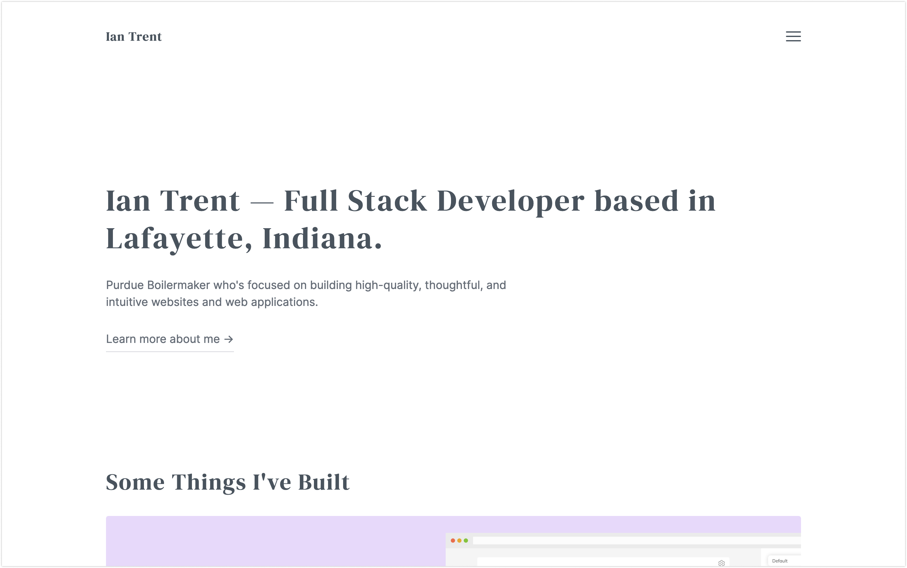

## Ian Trent

### [iantrent.com](https://iantrent.com)

### About Me

I'm a Software Engineer focused on building high-quality, thoughtful, and intuitive websites and web applications. Currently, I'm pursuing a Bachelor's degree in Web Programming and Design, as well as a Certificate in Entrepreneurship at Purdue University.

As a developer at SFP, I have had the opportunity to work along-side professionals in notable projects. I value the ideas of hard-work and persistence. These values have aided my career as a developer and have shaped me into the person I am today.

I like to spend my free time adding on to my web stack and chasing my dream of becoming a full-time software engineer. Other than coding, I find myself binge-watching that new series on Netflix, petting all the dogs I can, or scoping out the best burger joint in town.

### Social Media

[Github](https://github.com/imtrent)
[Twitter](https://twitter.com/ianmtrent)
[Linkedin](https://www.linkedin.com/in/ianmtrent/)
